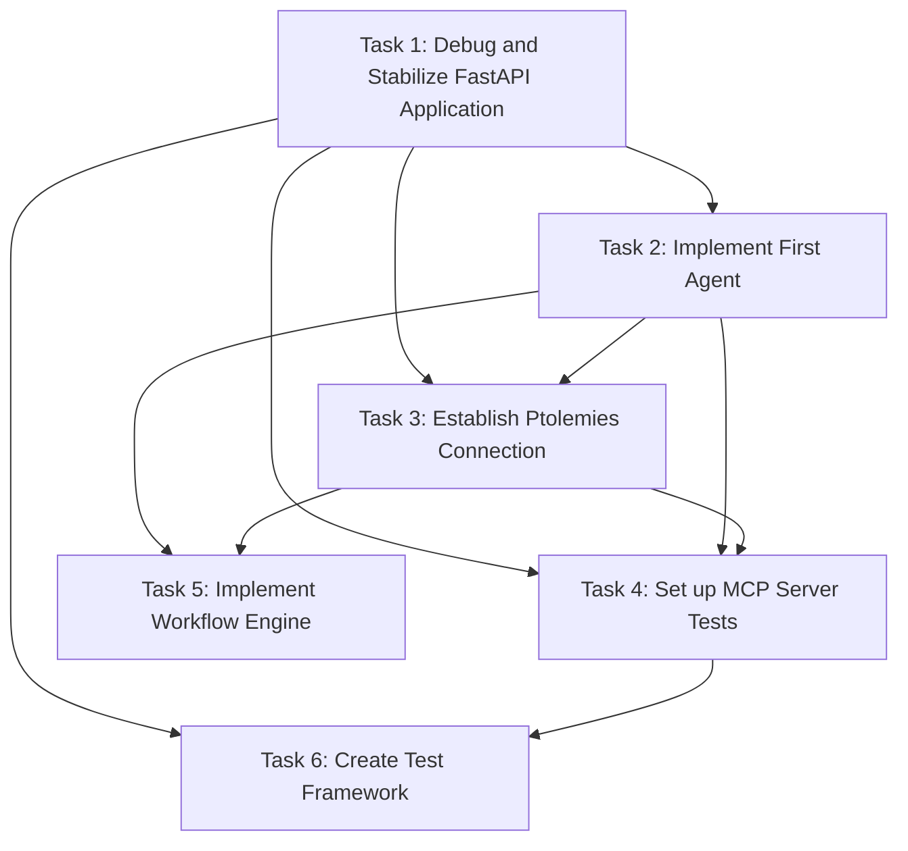
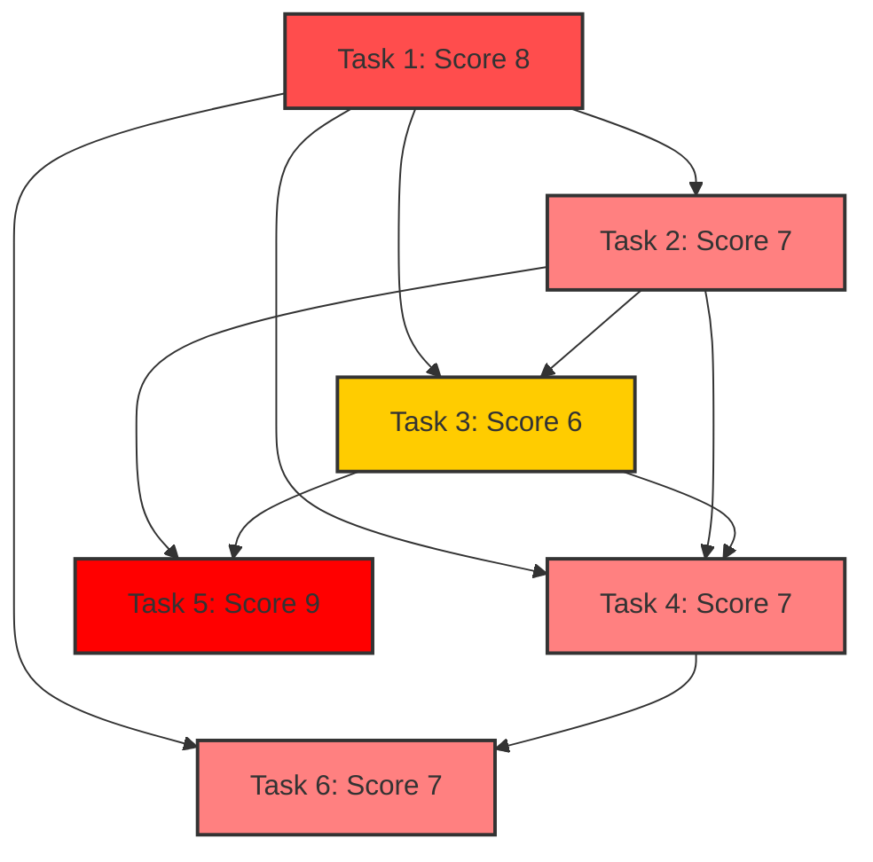

# Agentical Project - Task and Complexity Report

## 1. Overview

This report provides a comprehensive view of all tasks and subtasks for the Agentical project, including their complexity scores as determined by TaskMaster's AI-based analysis.

### Project Summary

- **Total Tasks**: 6
- **Tasks In Progress**: 0
- **Tasks Completed**: 2
- **Subtasks Completed**: 12
- **Subtasks In Progress**: 0

### Complexity Distribution

- **High Complexity (8-10)**: 2 tasks (33%)
- **Medium Complexity (5-7)**: 4 tasks (67%)
- **Low Complexity (1-4)**: 0 tasks (0%)

## 2. Task Breakdown with Complexity Scores

### Task 1: Debug and Stabilize FastAPI Application
**Status**: Completed  
**Priority**: High  
**Dependencies**: None  
**Complexity Score**: 🔴 8 (High)  

#### Subtasks:
1.1. ✅ **Implement Structured Logging System** (Done)
1.2. ✅ **Implement Global Exception Handling** (Done)
1.3. ✅ **Optimize Database Interactions and Performance** (Done)
1.4. ✅ **Implement Health Check and Monitoring Endpoints** (Done)
1.5. ✅ **Enhance Request Validation and Security** (Done)

### Task 2: Implement First Agent with FastAPI Integration
**Status**: Completed  
**Priority**: High  
**Dependencies**: 1  
**Complexity Score**: 🔴 7 (Medium)  

#### Subtasks:
2.1. ✅ **Define Agent Class Structure and Core Capabilities** (Done)
2.2. ✅ **Implement FastAPI Integration Points for Agent** (Done)
2.3. ✅ **Develop Agent Main Loop and Event Handlers** (Done)
2.4. ✅ **Implement Error Handling and Recovery Mechanisms** (Done)
2.5. ✅ **Optimize Performance and Create Documentation** (Done)

### Task 3: Establish Reliable Connection to Ptolemies Knowledge Base
**Status**: Pending  
**Priority**: Medium  
**Dependencies**: Tasks 1, 2  
**Complexity Score**: 🟡 6 (Medium)  

#### Subtasks:
3.1. ⏱️ **Research and Configure Knowledge Base Connection Parameters** (Pending)
3.2. ⏱️ **Implement Core Connection Module with Error Handling** (Pending)
3.3. ⏱️ **Design and Implement Query Interface with Security Features** (Pending)
3.4. ⏱️ **Implement Caching and Performance Optimization** (Pending)
3.5. ⏱️ **Create Agent Integration Layer and Documentation** (Pending)

### Task 4: Set up MCP Server Integration Tests
**Status**: Pending  
**Priority**: Medium  
**Dependencies**: Tasks 1, 2, 3  
**Complexity Score**: 🔴 7 (Medium)  

#### Subtasks:
4.1. ⏱️ **Configure Testing Framework and Environment** (Pending)
4.2. ⏱️ **Implement Test Database Management** (Pending)
4.3. ⏱️ **Develop Mock Services for External Dependencies** (Pending)
4.4. ⏱️ **Implement Core Integration Test Suites** (Pending)
4.5. ⏱️ **Set Up CI/CD Integration and Documentation** (Pending)

### Task 5: Implement Workflow Engine for Agent Coordination
**Status**: Pending  
**Priority**: Medium  
**Dependencies**: Tasks 1, 2, 3  
**Complexity Score**: 🔴 9 (High)  

#### Subtasks:
5.1. ⏱️ **Design Workflow Specification Format and Core Data Structures** (Pending)
5.2. ⏱️ **Implement Workflow Parser and State Manager** (Pending)
5.3. ⏱️ **Build Workflow Scheduler and Execution Engine** (Pending)
5.4. ⏱️ **Develop Agent Integration Interfaces and Communication Channels** (Pending)
5.5. ⏱️ **Implement Workflow Control API and Monitoring Dashboard** (Pending)

### Task 6: Create Test Framework Infrastructure with PyTest and Logfire
**Status**: In Progress  
**Priority**: High  
**Dependencies**: Tasks 1, 4  
**Complexity Score**: 🔴 7 (Medium)  

#### Subtasks:
6.1. ✅ **Set up PyTest Environment and Directory Structure** (Done)
6.2. ✅ **Integrate Logfire SDK with Custom PyTest Plugin** (Done)
6.3. ✅ **Implement Base Test Classes and Fixtures** (Done)
6.4. ✅ **Develop Test Utilities and Data Factories** (Done)
6.5. ⏱️ **Configure CI/CD Integration and Documentation** (Pending)

## 3. Critical Path Analysis

Based on task dependencies and complexity scores, the critical path for the project is:

1. **Task 1** (Complexity: 8) → **Task 2** (Complexity: 7) → **Task 3** (Complexity: 6) → **Task 5** (Complexity: 9)

The highest complexity task is **Task 5: Implement Workflow Engine for Agent Coordination** with a score of 9. This task represents the most challenging component of the project and will require careful planning and implementation.

## 4. Current Focus

The current development focus is on:

1. **Task 1: Debug and Stabilize FastAPI Application** (Completed)
   - Subtask 1.1: Implement Structured Logging System (Completed)
   - Subtask 1.2: Implement Global Exception Handling (Completed)
   - Subtask 1.3: Optimize Database Interactions and Performance (Completed)
   - Subtask 1.4: Implement Health Check and Monitoring Endpoints (Completed)
   - Subtask 1.5: Enhance Request Validation and Security (Completed)
   
2. **Task 2: Implement First Agent with FastAPI Integration** (Completed)
   - Subtask 2.1: Define Agent Class Structure and Core Capabilities (Completed)
   - Subtask 2.2: Implement FastAPI Integration Points for Agent (Completed)
   - Subtask 2.3: Develop Agent Main Loop and Event Handlers (Completed)
   - Subtask 2.4: Implement Error Handling and Recovery Mechanisms (Completed)
   - Subtask 2.5: Optimize Performance and Create Documentation (Completed)
   
3. **Task 6: Create Test Framework Infrastructure** (In Progress)
   - Subtask 6.1: Set up PyTest Environment and Directory Structure (Completed)
   - Subtask 6.2: Integrate Logfire SDK with Custom PyTest Plugin (Completed)
   - Subtask 6.3: Implement Base Test Classes and Fixtures (Completed)
   - Subtask 6.4: Develop Test Utilities and Data Factories (Completed)

## 5. Recommended Actions

Based on the complexity analysis and current progress:

1. Complete Subtask 6.5 to configure CI/CD integration and documentation
2. Begin Task 3 (Establish Reliable Connection to Ptolemies Knowledge Base) as it is now unblocked
3. Consider breaking down Task 5 into more detailed subtasks due to its high complexity score
4. Conduct thorough testing of agent implementations in Task 2
5. Plan for integration testing between agents and knowledge base (Task 3)

## 6. Dependency Graph

## 7. Complexity Heatmap

## 8. Legend

- **Status Indicators**:
  - ✅ Done
  - 🔄 In Progress
  - ⏱️ Pending

- **Complexity Indicators**:
  - 🔴 High (8-10)
  - 🟡 Medium (5-7)
  - 🟢 Low (1-4)