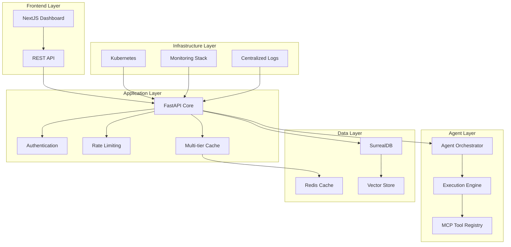
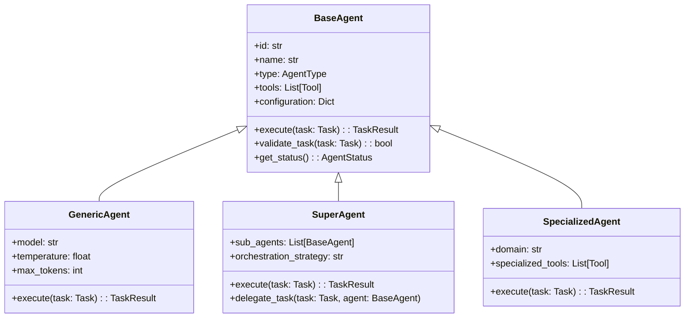

# Agentical Platform - Technical Documentation

## Overview

Agentical is a production-grade multi-agent orchestration platform built on modern cloud-native architecture. This documentation provides comprehensive technical details for developers, system administrators, and platform engineers.

## Table of Contents

1. [Architecture Overview](#architecture-overview)
2. [Core Components](#core-components)
3. [API Reference](#api-reference)
4. [Database Schema](#database-schema)
5. [Agent System](#agent-system)
6. [MCP Tool Integration](#mcp-tool-integration)
7. [Performance & Monitoring](#performance--monitoring)
8. [Deployment Architecture](#deployment-architecture)
9. [Security Framework](#security-framework)
10. [Development Guidelines](#development-guidelines)
11. [Troubleshooting](#troubleshooting)
12. [Migration Guides](#migration-guides)

---

## Architecture Overview

### System Architecture



### Technology Stack

#### Backend Technologies
- **FastAPI 0.104+**: High-performance Python web framework
- **SurrealDB**: Multi-model database with vector search capabilities
- **Redis**: Multi-tier caching and session management
- **Pydantic**: Data validation and serialization
- **Logfire**: Primary observability and APM platform

#### Frontend Technologies
- **Next.js 14**: React-based web application framework
- **TypeScript**: Type-safe JavaScript development
- **Tailwind CSS**: Utility-first CSS framework
- **Shadcn/ui**: Modern component library

#### Infrastructure Technologies
- **Kubernetes**: Container orchestration platform
- **Prometheus + Grafana**: Infrastructure monitoring
- **Jaeger**: Distributed tracing
- **Fluent Bit + Loki**: Log aggregation
- **Terraform**: Infrastructure as Code

---

## Core Components

### 1. FastAPI Application Core

#### Application Structure
```
core/
├── main.py                 # Application entry point
├── config.py              # Configuration management
├── dependencies.py        # Dependency injection
├── middleware/
│   ├── auth.py           # Authentication middleware
│   ├── rate_limiting.py  # Rate limiting implementation
│   └── logging.py        # Request/response logging
├── exceptions.py          # Custom exception handlers
└── lifespan.py           # Application lifecycle management
```

#### Configuration System

```python
# core/config.py
from pydantic_settings import BaseSettings
from typing import Optional, List
import os

class Settings(BaseSettings):
    """Application configuration with environment variable support."""
    
    # Application Settings
    app_name: str = "Agentical Platform"
    version: str = "1.0.0"
    environment: str = "production"
    debug: bool = False
    
    # Database Configuration
    surrealdb_url: str = "ws://localhost:8000/rpc"
    surrealdb_username: str = "root"
    surrealdb_password: str = "root"
    surrealdb_namespace: str = "agentical"
    surrealdb_database: str = "production"
    
    # Redis Configuration
    redis_url: str = "redis://localhost:6379"
    redis_password: Optional[str] = None
    redis_db: int = 0
    
    # Security Settings
    secret_key: str
    jwt_algorithm: str = "HS256"
    access_token_expire_minutes: int = 30
    
    # Rate Limiting
    rate_limit_requests: int = 100
    rate_limit_window: int = 60
    
    # Monitoring
    logfire_token: Optional[str] = None
    logfire_project_name: str = "agentical-production"
    
    class Config:
        env_file = ".env"
        case_sensitive = False

settings = Settings()
```

#### Dependency Injection

```python
# core/dependencies.py
from fastapi import Depends, HTTPException, status
from fastapi.security import HTTPBearer, HTTPAuthorizationCredentials
from typing import AsyncGenerator
import asyncio

# Database dependency
async def get_database() -> AsyncGenerator[SurrealDBConnection, None]:
    """Provide database connection with proper cleanup."""
    db = None
    try:
        db = await create_surrealdb_connection()
        yield db
    finally:
        if db:
            await db.close()

# Cache dependency
async def get_cache() -> AsyncGenerator[RedisConnection, None]:
    """Provide Redis cache connection."""
    cache = None
    try:
        cache = await create_redis_connection()
        yield cache
    finally:
        if cache:
            await cache.close()

# Authentication dependency
security = HTTPBearer()

async def get_current_user(
    credentials: HTTPAuthorizationCredentials = Depends(security),
    db: SurrealDBConnection = Depends(get_database)
) -> User:
    """Extract and validate user from JWT token."""
    try:
        payload = jwt.decode(
            credentials.credentials,
            settings.secret_key,
            algorithms=[settings.jwt_algorithm]
        )
        user_id = payload.get("sub")
        if user_id is None:
            raise HTTPException(
                status_code=status.HTTP_401_UNAUTHORIZED,
                detail="Invalid authentication credentials"
            )
        
        user = await get_user_by_id(db, user_id)
        if user is None:
            raise HTTPException(
                status_code=status.HTTP_401_UNAUTHORIZED,
                detail="User not found"
            )
        
        return user
    except jwt.JWTError:
        raise HTTPException(
            status_code=status.HTTP_401_UNAUTHORIZED,
            detail="Invalid authentication credentials"
        )
```

### 2. Database Layer (SurrealDB)

#### Database Connection Management

```python
# db/connection.py
from surrealdb import Surreal
from contextlib import asynccontextmanager
import logfire
from typing import AsyncGenerator

class SurrealDBManager:
    """SurrealDB connection and query management."""
    
    def __init__(self):
        self.db = None
        self._connection_pool = None
    
    @logfire.instrument()
    async def initialize(self):
        """Initialize database connection with retry logic."""
        max_retries = 3
        for attempt in range(max_retries):
            try:
                self.db = Surreal()
                await self.db.connect(settings.surrealdb_url)
                await self.db.signin({
                    "user": settings.surrealdb_username,
                    "pass": settings.surrealdb_password
                })
                await self.db.use(
                    settings.surrealdb_namespace,
                    settings.surrealdb_database
                )
                
                logfire.info("SurrealDB connection established")
                return
            except Exception as e:
                logfire.error(f"Database connection attempt {attempt + 1} failed: {e}")
                if attempt == max_retries - 1:
                    raise
                await asyncio.sleep(2 ** attempt)
    
    @logfire.instrument()
    async def execute_query(self, query: str, params: dict = None):
        """Execute SurrealDB query with monitoring."""
        try:
            start_time = time.time()
            result = await self.db.query(query, params or {})
            duration = time.time() - start_time
            
            logfire.info(
                "Database query executed",
                query=query[:100],  # Truncate for logging
                duration_ms=duration * 1000,
                params_count=len(params) if params else 0
            )
            
            return result
        except Exception as e:
            logfire.error(f"Database query failed: {e}", query=query)
            raise
    
    async def close(self):
        """Close database connection."""
        if self.db:
            await self.db.close()
            logfire.info("SurrealDB connection closed")

# Global database manager instance
db_manager = SurrealDBManager()
```

#### Database Schema

```sql
-- Core database schema for Agentical platform

-- Users table
DEFINE TABLE users SCHEMAFULL;
DEFINE FIELD id ON users TYPE record<users>;
DEFINE FIELD username ON users TYPE string ASSERT $value != NONE;
DEFINE FIELD email ON users TYPE string ASSERT is::email($value);
DEFINE FIELD password_hash ON users TYPE string;
DEFINE FIELD created_at ON users TYPE datetime DEFAULT time::now();
DEFINE FIELD updated_at ON users TYPE datetime DEFAULT time::now();
DEFINE FIELD is_active ON users TYPE bool DEFAULT true;
DEFINE FIELD role ON users TYPE string DEFAULT "user";

-- Agents table
DEFINE TABLE agents SCHEMAFULL;
DEFINE FIELD id ON agents TYPE record<agents>;
DEFINE FIELD name ON agents TYPE string ASSERT $value != NONE;
DEFINE FIELD description ON agents TYPE string;
DEFINE FIELD type ON agents TYPE string ASSERT $value IN ["generic", "super", "specialized"];
DEFINE FIELD configuration ON agents TYPE object;
DEFINE FIELD tools ON agents TYPE array<string>;
DEFINE FIELD created_by ON agents TYPE record<users>;
DEFINE FIELD created_at ON agents TYPE datetime DEFAULT time::now();
DEFINE FIELD updated_at ON agents TYPE datetime DEFAULT time::now();
DEFINE FIELD is_active ON agents TYPE bool DEFAULT true;
DEFINE FIELD status ON agents TYPE string DEFAULT "idle";

-- Tasks table
DEFINE TABLE tasks SCHEMAFULL;
DEFINE FIELD id ON tasks TYPE record<tasks>;
DEFINE FIELD title ON tasks TYPE string ASSERT $value != NONE;
DEFINE FIELD description ON tasks TYPE string;
DEFINE FIELD type ON tasks TYPE string;
DEFINE FIELD priority ON tasks TYPE string DEFAULT "medium";
DEFINE FIELD status ON tasks TYPE string DEFAULT "pending";
DEFINE FIELD input_data ON tasks TYPE object;
DEFINE FIELD output_data ON tasks TYPE object;
DEFINE FIELD assigned_agent ON tasks TYPE record<agents>;
DEFINE FIELD created_by ON tasks TYPE record<users>;
DEFINE FIELD created_at ON tasks TYPE datetime DEFAULT time::now();
DEFINE FIELD updated_at ON tasks TYPE datetime DEFAULT time::now();
DEFINE FIELD started_at ON tasks TYPE datetime;
DEFINE FIELD completed_at ON tasks TYPE datetime;
DEFINE FIELD error_message ON tasks TYPE string;

-- Executions table (task execution logs)
DEFINE TABLE executions SCHEMAFULL;
DEFINE FIELD id ON executions TYPE record<executions>;
DEFINE FIELD task_id ON executions TYPE record<tasks>;
DEFINE FIELD agent_id ON executions TYPE record<agents>;
DEFINE FIELD status ON executions TYPE string DEFAULT "running";
DEFINE FIELD steps ON executions TYPE array<object>;
DEFINE FIELD metrics ON executions TYPE object;
DEFINE FIELD started_at ON executions TYPE datetime DEFAULT time::now();
DEFINE FIELD completed_at ON executions TYPE datetime;
DEFINE FIELD duration_ms ON executions TYPE number;

-- MCP Tools registry
DEFINE TABLE mcp_tools SCHEMAFULL;
DEFINE FIELD id ON mcp_tools TYPE record<mcp_tools>;
DEFINE FIELD name ON mcp_tools TYPE string ASSERT $value != NONE;
DEFINE FIELD description ON mcp_tools TYPE string;
DEFINE FIELD server_url ON mcp_tools TYPE string;
DEFINE FIELD capabilities ON mcp_tools TYPE array<string>;
DEFINE FIELD configuration ON mcp_tools TYPE object;
DEFINE FIELD is_enabled ON mcp_tools TYPE bool DEFAULT true;
DEFINE FIELD health_status ON mcp_tools TYPE string DEFAULT "unknown";
DEFINE FIELD last_health_check ON mcp_tools TYPE datetime;
DEFINE FIELD created_at ON mcp_tools TYPE datetime DEFAULT time::now();
DEFINE FIELD updated_at ON mcp_tools TYPE datetime DEFAULT time::now();

-- Playbooks table
DEFINE TABLE playbooks SCHEMAFULL;
DEFINE FIELD id ON playbooks TYPE record<playbooks>;
DEFINE FIELD name ON playbooks TYPE string ASSERT $value != NONE;
DEFINE FIELD description ON playbooks TYPE string;
DEFINE FIELD steps ON playbooks TYPE array<object>;
DEFINE FIELD variables ON playbooks TYPE object;
DEFINE FIELD triggers ON playbooks TYPE array<object>;
DEFINE FIELD created_by ON playbooks TYPE record<users>;
DEFINE FIELD created_at ON playbooks TYPE datetime DEFAULT time::now();
DEFINE FIELD updated_at ON playbooks TYPE datetime DEFAULT time::now();
DEFINE FIELD is_active ON playbooks TYPE bool DEFAULT true;

-- Indexes for performance
DEFINE INDEX users_email_idx ON users FIELDS email UNIQUE;
DEFINE INDEX users_username_idx ON users FIELDS username UNIQUE;
DEFINE INDEX tasks_status_idx ON tasks FIELDS status;
DEFINE INDEX tasks_created_at_idx ON tasks FIELDS created_at;
DEFINE INDEX executions_task_idx ON executions FIELDS task_id;
DEFINE INDEX executions_agent_idx ON executions FIELDS agent_id;
DEFINE INDEX agents_type_idx ON agents FIELDS type;
DEFINE INDEX mcp_tools_enabled_idx ON mcp_tools FIELDS is_enabled;
```

### 3. Caching Layer (Redis)

#### Multi-tier Cache Implementation

```python
# cache/manager.py
from typing import Any, Optional, Union, Dict
import redis.asyncio as redis
import json
import pickle
from datetime import timedelta
import logfire

class CacheManager:
    """Multi-tier caching with Redis backend and in-memory L1 cache."""
    
    def __init__(self):
        self.redis_client = None
        self.l1_cache = {}  # In-memory cache
        self.l1_max_size = 1000
        self.l1_ttl = 300  # 5 minutes
    
    async def initialize(self):
        """Initialize Redis connection."""
        self.redis_client = redis.from_url(
            settings.redis_url,
            password=settings.redis_password,
            db=settings.redis_db,
            decode_responses=False  # Handle binary data
        )
        
        # Test connection
        await self.redis_client.ping()
        logfire.info("Redis connection established")
    
    @logfire.instrument()
    async def get(self, key: str, default: Any = None) -> Any:
        """Get value from cache with L1/L2 fallback."""
        # Check L1 cache first
        l1_value = self._get_l1(key)
        if l1_value is not None:
            logfire.info("Cache hit (L1)", key=key)
            return l1_value
        
        # Check Redis (L2 cache)
        try:
            value = await self.redis_client.get(key)
            if value is not None:
                # Deserialize and store in L1
                deserialized = pickle.loads(value)
                self._set_l1(key, deserialized)
                logfire.info("Cache hit (L2)", key=key)
                return deserialized
        except Exception as e:
            logfire.error(f"Redis get error: {e}", key=key)
        
        logfire.info("Cache miss", key=key)
        return default
    
    @logfire.instrument()
    async def set(
        self,
        key: str,
        value: Any,
        ttl: Optional[Union[int, timedelta]] = None
    ) -> bool:
        """Set value in both L1 and L2 cache."""
        # Set in L1 cache
        self._set_l1(key, value)
        
        # Set in Redis (L2 cache)
        try:
            serialized = pickle.dumps(value)
            if isinstance(ttl, timedelta):
                ttl = int(ttl.total_seconds())
            
            result = await self.redis_client.set(key, serialized, ex=ttl)
            logfire.info("Cache set", key=key, ttl=ttl)
            return result
        except Exception as e:
            logfire.error(f"Redis set error: {e}", key=key)
            return False
    
    @logfire.instrument()
    async def delete(self, key: str) -> bool:
        """Delete from both L1 and L2 cache."""
        # Remove from L1
        self.l1_cache.pop(key, None)
        
        # Remove from Redis
        try:
            result = await self.redis_client.delete(key)
            logfire.info("Cache delete", key=key)
            return bool(result)
        except Exception as e:
            logfire.error(f"Redis delete error: {e}", key=key)
            return False
    
    def _get_l1(self, key: str) -> Any:
        """Get from L1 cache with TTL check."""
        if key in self.l1_cache:
            value, timestamp = self.l1_cache[key]
            if time.time() - timestamp < self.l1_ttl:
                return value
            else:
                # Expired, remove from L1
                del self.l1_cache[key]
        return None
    
    def _set_l1(self, key: str, value: Any):
        """Set in L1 cache with size limit."""
        # Implement LRU eviction if cache is full
        if len(self.l1_cache) >= self.l1_max_size:
            # Remove oldest entry
            oldest_key = min(self.l1_cache.keys(), 
                           key=lambda k: self.l1_cache[k][1])
            del self.l1_cache[oldest_key]
        
        self.l1_cache[key] = (value, time.time())

# Global cache manager instance
cache_manager = CacheManager()
```

---

## API Reference

### Authentication Endpoints

#### POST /api/v1/auth/login
Authenticate user and return JWT token.

**Request Body:**
```json
{
  "username": "string",
  "password": "string"
}
```

**Response:**
```json
{
  "access_token": "string",
  "token_type": "bearer",
  "expires_in": 1800,
  "user": {
    "id": "users:uuid",
    "username": "string",
    "email": "string",
    "role": "string"
  }
}
```

**Error Responses:**
- `400 Bad Request`: Invalid request format
- `401 Unauthorized`: Invalid credentials
- `429 Too Many Requests`: Rate limit exceeded

#### POST /api/v1/auth/refresh
Refresh JWT token.

**Headers:**
```
Authorization: Bearer <token>
```

**Response:**
```json
{
  "access_token": "string",
  "token_type": "bearer",
  "expires_in": 1800
}
```

### Agent Management Endpoints

#### GET /api/v1/agents
List all agents with pagination and filtering.

**Query Parameters:**
- `page`: Page number (default: 1)
- `size`: Page size (default: 10, max: 100)
- `type`: Agent type filter (`generic`, `super`, `specialized`)
- `status`: Status filter (`idle`, `busy`, `error`)
- `search`: Search in name and description

**Response:**
```json
{
  "agents": [
    {
      "id": "agents:uuid",
      "name": "string",
      "description": "string",
      "type": "generic",
      "status": "idle",
      "tools": ["string"],
      "created_at": "2024-01-01T00:00:00Z",
      "updated_at": "2024-01-01T00:00:00Z"
    }
  ],
  "total": 0,
  "page": 1,
  "size": 10,
  "pages": 1
}
```

#### POST /api/v1/agents
Create a new agent.

**Request Body:**
```json
{
  "name": "string",
  "description": "string",
  "type": "generic",
  "configuration": {
    "model": "claude-3-sonnet",
    "temperature": 0.7,
    "max_tokens": 4000
  },
  "tools": ["filesystem", "web_search"]
}
```

**Response:**
```json
{
  "id": "agents:uuid",
  "name": "string",
  "description": "string",
  "type": "generic",
  "configuration": {},
  "tools": ["string"],
  "status": "idle",
  "created_at": "2024-01-01T00:00:00Z",
  "created_by": "users:uuid"
}
```

#### GET /api/v1/agents/{agent_id}
Get agent by ID.

**Response:**
```json
{
  "id": "agents:uuid",
  "name": "string",
  "description": "string",
  "type": "generic",
  "configuration": {},
  "tools": ["string"],
  "status": "idle",
  "created_at": "2024-01-01T00:00:00Z",
  "updated_at": "2024-01-01T00:00:00Z",
  "created_by": "users:uuid",
  "statistics": {
    "total_tasks": 0,
    "completed_tasks": 0,
    "failed_tasks": 0,
    "average_duration_ms": 0
  }
}
```

### Task Management Endpoints

#### POST /api/v1/tasks
Create and execute a new task.

**Request Body:**
```json
{
  "title": "string",
  "description": "string",
  "type": "analysis",
  "priority": "medium",
  "input_data": {
    "prompt": "Analyze this data...",
    "parameters": {}
  },
  "agent_id": "agents:uuid",
  "timeout_seconds": 300
}
```

**Response:**
```json
{
  "id": "tasks:uuid",
  "title": "string",
  "status": "pending",
  "priority": "medium",
  "created_at": "2024-01-01T00:00:00Z",
  "estimated_duration_ms": 5000
}
```

#### GET /api/v1/tasks/{task_id}
Get task status and results.

**Response:**
```json
{
  "id": "tasks:uuid",
  "title": "string",
  "description": "string",
  "status": "completed",
  "priority": "medium",
  "input_data": {},
  "output_data": {
    "result": "Analysis complete...",
    "confidence": 0.95,
    "metadata": {}
  },
  "assigned_agent": "agents:uuid",
  "created_at": "2024-01-01T00:00:00Z",
  "started_at": "2024-01-01T00:00:10Z",
  "completed_at": "2024-01-01T00:01:15Z",
  "duration_ms": 65000,
  "execution": {
    "id": "executions:uuid",
    "steps": [
      {
        "name": "initialize",
        "status": "completed",
        "duration_ms": 100
      }
    ]
  }
}
```

### MCP Tool Integration Endpoints

#### GET /api/v1/tools
List available MCP tools.

**Response:**
```json
{
  "tools": [
    {
      "id": "mcp_tools:uuid",
      "name": "filesystem",
      "description": "File system operations",
      "capabilities": ["read", "write", "list"],
      "health_status": "healthy",
      "last_health_check": "2024-01-01T00:00:00Z"
    }
  ]
}
```

#### POST /api/v1/tools/{tool_name}/execute
Execute MCP tool function.

**Request Body:**
```json
{
  "function": "read_file",
  "parameters": {
    "path": "/path/to/file.txt"
  }
}
```

**Response:**
```json
{
  "success": true,
  "result": {
    "content": "file contents...",
    "size": 1024,
    "modified": "2024-01-01T00:00:00Z"
  },
  "execution_time_ms": 150
}
```

---

## Agent System

### Agent Architecture



### Agent Implementation

```python
# agents/base_agent.py
from abc import ABC, abstractmethod
from typing import Dict, List, Any, Optional
from pydantic import BaseModel
import asyncio
import time
import logfire

class AgentConfiguration(BaseModel):
    """Agent configuration schema."""
    model: str = "claude-3-sonnet"
    temperature: float = 0.7
    max_tokens: int = 4000
    timeout_seconds: int = 300
    retry_attempts: int = 3
    custom_parameters: Dict[str, Any] = {}

class TaskResult(BaseModel):
    """Task execution result."""
    success: bool
    result: Any
    error_message: Optional[str] = None
    execution_time_ms: int
    steps: List[Dict[str, Any]] = []
    metadata: Dict[str, Any] = {}

class BaseAgent(ABC):
    """Abstract base class for all agents."""
    
    def __init__(
        self,
        agent_id: str,
        name: str,
        configuration: AgentConfiguration,
        tools: List[str] = None
    ):
        self.id = agent_id
        self.name = name
        self.configuration = configuration
        self.tools = tools or []
        self.status = "idle"
        self.current_task = None
        self.metrics = {
            "total_tasks": 0,
            "completed_tasks": 0,
            "failed_tasks": 0,
            "total_execution_time_ms": 0
        }
    
    @abstractmethod
    @logfire.instrument()
    async def execute(self, task: "Task") -> TaskResult:
        """Execute a task and return the result."""
        pass
    
    @logfire.instrument()
    async def validate_task(self, task: "Task") -> bool:
        """Validate if agent can handle the task."""
        # Basic validation - can be overridden
        if not task.input_data:
            return False
        
        # Check if agent has required tools
        required_tools = task.input_data.get("required_tools", [])
        if required_tools:
            return all(tool in self.tools for tool in required_tools)
        
        return True
    
    @logfire.instrument()
    async def _execute_with_monitoring(self, task: "Task") -> TaskResult:
        """Execute task with comprehensive monitoring."""
        start_time = time.time()
        self.status = "busy"
        self.current_task = task.id
        
        try:
            # Update metrics
            self.metrics["total_tasks"] += 1
            
            # Execute the task
            result = await asyncio.wait_for(
                self.execute(task),
                timeout=self.configuration.timeout_seconds
            )
            
            # Calculate execution time
            execution_time_ms = int((time.time() - start_time) * 1000)
            result.execution_time_ms = execution_time_ms
            
            # Update success metrics
            if result.success:
                self.metrics["completed_tasks"] += 1
            else:
                self.metrics["failed_tasks"] += 1
            
            self.metrics["total_execution_time_ms"] += execution_time_ms
            
            logfire.info(
                "Task execution completed",
                agent_id=self.id,
                task_id=task.id,
                success=result.success,
                execution_time_ms=execution_time_ms
            )
            
            return result
            
        except asyncio.TimeoutError:
            execution_time_ms = int((time.time() - start_time) * 1000)
            self.metrics["failed_tasks"] += 1
            
            logfire.error(
                "Task execution timeout",
                agent_id=self.id,
                task_id=task.id,
                timeout_seconds=self.configuration.timeout_seconds
            )
            
            return TaskResult(
                success=False,
                result=None,
                error_message=f"Task execution timeout after {self.configuration.timeout_seconds} seconds",
                execution_time_ms=execution_time_ms
            )
            
        except Exception as e:
            execution_time_ms = int((time.time() - start_time) * 1000)
            self.metrics["failed_tasks"] += 1
            
            logfire.error(
                "Task execution error",
                agent_id=self.id,
                task_id=task.id,
                error=str(e)
            )
            
            return TaskResult(
                success=False,
                result=None,
                error_message=str(e),
                execution_time_ms=execution_time_ms
            )
            
        finally:
            self.status = "idle"
            self.current_task = None
    
    def get_metrics(self) -> Dict[str, Any]:
        """Get agent performance metrics."""
        metrics = self.metrics.copy()
        if metrics["completed_tasks"] > 0:
            metrics["average_execution_time_ms"] = (
                metrics["total_execution_time_ms"] / metrics["completed_tasks"]
            )
        else:
            metrics["average_execution_time_ms"] = 0
        
        metrics["success_rate"] = (
            metrics["completed_tasks"] / max(metrics["total_tasks"], 1)
        )
        
        return metrics
```

### Generic Agent Implementation

```python
# agents/generic_agent.py
from .base_agent import BaseAgent, TaskResult
from typing import Dict, Any
import aiohttp
import json
import logfire

class GenericAgent(BaseAgent):
    """Generic agent using LLM for task execution."""
    
    def __init__(self, *args, **kwargs):
        super().__init__(*args, **kwargs)
        self.api_client = None
    
    async def initialize(self):
        """Initialize the agent's API client."""
        self.api_client = aiohttp.ClientSession()
    
    @logfire.instrument()
    async def execute(self, task: "Task") -> TaskResult:
        """Execute task using LLM."""
        steps = []
        
        try:
            # Step 1: Prepare prompt
            steps.append({
                "name": "prepare_prompt",
                "status": "started",
                "timestamp": time.time()
            })
            
            prompt = self._build_prompt(task)
            
            steps[-1].update({
                "status": "completed",
                "duration_ms": 50
            })
            
            # Step 2: Execute LLM call
            steps.append({
                "name": "llm_execution",
                "status": "started",
                "timestamp": time.time()
            })
            
            result = await self._execute_llm_call(prompt)
            
            steps[-1].update({
                "status": "completed",
                "duration_ms": 2000
            })
            
            # Step 3: Process result
            steps.append({
                "name": "process_result",
                "status": "started",
                "timestamp": time.time()
            })
            
            processed_result = self._process_result(result)
            
            steps[-1].update({
                "status": "completed",
                "duration_ms": 100
            })
            
            return TaskResult(
                success=True,
                result=processed_result,
                steps=steps,
                metadata={
                    "model": self.configuration.model,
                    "temperature": self.configuration.temperature,
                    "tokens_used": result.get("usage", {}).get("total_tokens", 0)
                }
            )
            
        except Exception as e:
            # Mark current step as failed
            if steps and steps[-1]["status"] == "started":
                steps[-1]["status"] = "failed"
                steps[-1]["error"] = str(e)
            
            return TaskResult(
                success=False,
                result=None,
                error_message=str(e),
                steps=steps
            )
    
    def _build_prompt(self, task: "Task") -> str:
        """Build prompt for LLM based on task."""
        base_prompt = f"""
Task: {task.title}
Description: {task.description}
Type: {task.type}

Input Data:
{json.dumps(task.input_data, indent=2)}

Available Tools: {', '.join(self.tools)}

Please execute this task and provide a detailed response.
"""
        return base_prompt
    
    async def _execute_llm_call(self, prompt: str) -> Dict[str, Any]:
        """Execute LLM API call."""
        # Implementation depends on your LLM provider
        # This is a placeholder for the actual API call
        
        payload = {
            "model": self.configuration.model,
            "messages": [
                {"role": "user", "content": prompt}
            ],
            "temperature": self.configuration.temperature,
            "max_tokens": self.configuration.max_tokens
        }
        
        # Make API call to your LLM provider
        async with self.api_client.post(
            "https://api.anthropic.com/v1/messages",
            headers={
                "Authorization": f"Bearer {settings.anthropic_api_key}",
                "Content-Type": "application/json"
            },
            json=payload
        ) as response:
            if response.status == 200:
                return await response.json()
            else:
                raise Exception(f"LLM API call failed: {response.status}")
    
    def _process_result(self, llm_result: Dict[str, Any]) -> Any:
        """Process LLM result into final format."""
        content = llm_result.get("content", [])
        if content and len(content) > 0:
            return content[0].get("text", "")
        return llm_result
    
    async def cleanup(self):
        """Clean up resources."""
        if self.api_client:
            await self.api_client.close()
```

---

## MCP Tool Integration

### Tool Registry System

```python
# tools/registry.py
from typing import Dict, List, Any, Optional
import asyncio
import aiohttp
import json
import time
from datetime import datetime, timedelta
import logfire

class MCPToolRegistry:
    """Registry for managing MCP tools and their health status."""
    
    def __init__(self):
        self.tools: Dict[str, MCPTool] = {}
        self.health_check_interval = 300  # 5 minutes
        self._health_check_task = None
    
    async def initialize(self):
        """Initialize the tool registry."""
        await self._load_tools_from_database()
        self._health_check_task = asyncio.create_task(
            self._periodic_health_check()
        )
        logfire.info("MCP Tool Registry initialized")
    
    async def register_tool(
        self,
        name: str,
        server_url: str,
        capabilities: List[str],
        configuration: Dict[str, Any] = None
    ) -> bool:
        """Register a new MCP tool."""
        try:
            tool = MCPTool(
                name=name,
                server_url=server_url,
                capabilities=capabilities,
                configuration=configuration or {}
            )
            
            # Test tool connectivity
            health_status = await self._check_tool_health(tool)
            tool.health_status = health_status
            tool.last_health_check = datetime.utcnow()
            
            self.tools[name] = tool
            
            # Persist to database
            await self._save_tool_to_database(tool)
            
            logfire.info(f"Tool registered: {name}", health_status=health_status)
            return True
            
        except Exception as e:
            logfire.error(f"Failed to register tool {name}: {e}")
            return False
    
    async def execute_tool(
        self,
        tool_name: str,
        function: str,
        parameters: Dict[str, Any]
    ) -> Dict[str, Any]:
        """Execute a function on an MCP tool."""
        if tool_name not in self.tools:
            raise ValueError(f"Tool {tool_name} not found")
        
        tool = self.tools[tool_name]
        if not tool.is_enabled:
            raise ValueError(f"Tool {tool_name} is disabled")
        
        if tool.health_status != "healthy":
            # Try to refresh health status
            await self._check_tool_health(tool)
            if tool.health_status != "healthy":
                raise ValueError(f"Tool {tool_name} is not healthy: {tool.health_status}")
        
        start_time = time.time()
        
        try:
            result = await self._make_tool_request(tool, function, parameters)
            execution_time_ms = int((time.time() - start_time) * 1000)
            
            logfire.info(
                "Tool execution completed",
                tool_name=tool_name,
                function=function,
                execution_time_ms=execution_time_ms,
                success=True
            )
            
            return {
                "success": True,
                "result": result,
                "execution_time_ms": execution_time_ms
            }
            
        except Exception as e:
            execution_time_ms = int((time.time() - start_time) * 1000)
            
            logfire.error(
                "Tool execution failed",
                tool_name=tool_name,
                function=function,
                error=str(e),
                execution_time_ms=execution_time_ms
            )
            
            return {
                "success": False,
                "error": str(e),
                "execution_time_ms": execution_time_ms
            }
    
    async def _make_tool_request(
        self,
        tool: "MCPTool",
        function: str,
        parameters: Dict[str, Any]
    ) -> Any:
        """Make HTTP request to MCP tool server."""
        timeout = aiohttp.ClientTimeout(total=30)
        
        async with aiohttp.ClientSession(timeout=timeout) as session:
            payload = {
                "method": "tools/call",
                "params": {
                    "name": function,
                    "arguments": parameters
                }
            }
            
            async with session.post(
                f"{tool.server_url}/call",
                json=payload,
                headers={"Content-Type": "application/json"}
            ) as response:
                if response.status == 200:
                    result = await response.json()
                    return result.get("result")
                else:
                    error_text = await response.text()
                    raise Exception(f"Tool request failed: {response.status} - {error_text}")
    
    async def _check_tool_health(self, tool: "MCPTool") -> str:
        """Check health status of an MCP tool."""
        try:
            timeout = aiohttp.ClientTimeout(total=10)
            
            async with aiohttp.ClientSession(timeout=timeout) as session:
                async with session.get(f"{tool.server_url}/health") as response:
                    if response.status == 200:
                        health_data = await response.json()
                        return health_data.get("status", "healthy")
                    else:
                        return "unhealthy"
                        
        except asyncio.TimeoutError:
            return "timeout"
        except Exception as e:
            logfire.error(f"Health check failed for {tool.name}: {e}")
            return "error"
    
    async def _periodic_health_check(self):
        """Periodically check health of all tools."""
        while True:
            try:
                await asyncio.sleep(self.health_check_interval)
                
                logfire.info("Starting periodic health check")
                
                for tool_name, tool in self.tools.items():
                    if tool.is_enabled:
                        old_status = tool.health_status
                        new_status = await self._check_tool_health(tool)
                        tool.health_status = new_status
                        tool.last_health_check = datetime.utcnow()
                        
                        if old_status != new_status:
                            logfire.warning(
                                "Tool health status changed",
                                tool_name=tool_name,
                                old_status=old_status,
                                new_status=new_status
                            )
                        
                        # Update database
                        await self._update_tool_health_in_database(tool)
                
                logfire.info("Periodic health check completed")
                
            except Exception as e:
                logfire.error(f"Error in periodic health check: {e}")
    
    async def get_tools(self) -> List[Dict[str, Any]]:
        """Get list of all registered tools."""
        return [
            {
                "name": tool.name,
                "server_url": tool.server_url,
                "capabilities": tool.capabilities,
                "is_enabled": tool.is_enabled,
                "health_status": tool.health_status,
                "last_health_check": tool.last_health_check.isoformat() if tool.last_health_check else None
            }
            for tool in self.tools.values()
        ]
    
    async def cleanup(self):
        """Clean up registry resources."""
        if self._health_check_task:
            self._health_check_task.cancel()
            try:
                await self._health_check_task
            except asyncio.CancelledError:
                pass

class MCPTool:
    """Represents an MCP tool."""
    
    def __init__(
        self,
        name: str,
        server_url: str,
        capabilities: List[str],
        configuration: Dict[str, Any] = None
    ):
        self.name = name
        self.server_url = server_url
        self.capabilities = capabilities
        self.configuration = configuration or {}
        self.is_enabled = True
        self.health_status = "unknown"
        self.last_health_check = None
        self.created_at = datetime.utcnow()

# Global tool registry instance
tool_registry = MCPToolRegistry()
```

---

## Performance & Monitoring

### Logfire Integration

```python
# monitoring/logfire_setup.py
import logfire
from fastapi import FastAPI
from typing import Any, Dict
import time
import psutil
import asyncio

class AgenticalMonitoring:
    """Comprehensive monitoring setup for Agentical platform."""
    
    def __init__(self):
        self.setup_logfire()
        self.setup_structured_logging()
        self.metrics_collectors = {}
        self._system_metrics_task = None
    
    def setup_logfire(self):
        """Configure Logfire with custom settings."""
        logfire.configure(
            token=settings.logfire_token,
            project_name=settings.logfire_project_name,
            service_name="agentical-api",
            service_version="1.0.0",
            environment=settings.environment,
            
            # Custom configuration
            console={
                'colors': 'auto',
                'verbose': settings.debug,
                'include_timestamp': True,
                'min_log_level': 'info' if not settings.debug else 'debug'
            },
            
            # Sampling configuration for high-volume environments
            sampling={
                'head': 1.0,  # Always capture first trace in a chain
                'tail': 0.1,  # Sample 10% of subsequent traces
            }
        )
        
        logfire.info("Logfire monitoring initialized")
    
    def setup_structured_logging(self):
        """Setup structured logging patterns."""
        # Custom log formatters and handlers
        logfire.info("Structured logging configured")
    
    def instrument_fastapi(self, app: FastAPI) -> FastAPI:
        """Instrument FastAPI app with comprehensive monitoring."""
        # Enable automatic FastAPI instrumentation
        logfire.instrument_fastapi(
            app,
            capture_headers=True,
            capture_body=True,
            excluded_urls=[
                "/health",
                "/metrics",
                "/docs",
                "/redoc",
                "/openapi.json"
            ]
        )
        
        # Add custom middleware for additional metrics
        @app.middleware("http")
        async def monitoring_middleware(request, call_next):
            start_time = time.time()
            
            # Extract request context
            request_id = request.headers.get("X-Request-ID", "unknown")
            user_agent = request.headers.get("User-Agent", "unknown")
            
            with logfire.span(
                "http_request",
                method=request.method,
                url=str(request.url),
                request_id=request_id,
                user_agent=user_agent
            ):
                response = await call_next(request)
                
                duration_ms = (time.time() - start_time) * 1000
                
                # Log request completion
                logfire.info(
                    "HTTP request completed",
                    method=request.method,
                    path=request.url.path,
                    status_code=response.status_code,
                    duration_ms=duration_ms,
                    request_id=request_id
                )
                
                # Track performance metrics
                self._track_request_metrics(
                    request.method,
                    request.url.path,
                    response.status_code,
                    duration_ms
                )
                
                response.headers["X-Response-Time"] = f"{duration_ms:.2f}ms"
                return response
        
        logfire.info("FastAPI instrumentation completed")
        return app
    
    def _track_request_metrics(
        self,
        method: str,
        path: str,
        status_code: int,
        duration_ms: float
    ):
        """Track custom request metrics."""
        # Track response time by endpoint
        logfire.metric_histogram(
            "http_request_duration_ms",
            value=duration_ms,
            tags={
                "method": method,
                "path": path,
                "status_code": str(status_code)
            }
        )
        
        # Track request count
        logfire.metric_counter(
            "http_requests_total",
            value=1,
            tags={
                "method": method,
                "path": path,
                "status_code": str(status_code)
            }
        )
        
        # Track error rate
        if status_code >= 400:
            logfire.metric_counter(
                "http_errors_total",
                value=1,
                tags={
                    "method": method,
                    "path": path,
                    "status_code": str(status_code)
                }
            )
    
    async def start_system_metrics_collection(self):
        """Start collecting system-level metrics."""
        self._system_metrics_task = asyncio.create_task(
            self._collect_system_metrics()
        )
        logfire.info("System metrics collection started")
    
    async def _collect_system_metrics(self):
        """Collect system metrics periodically."""
        while True:
            try:
                # CPU metrics
                cpu_percent = psutil.cpu_percent(interval=1)
                logfire.metric_gauge(
                    "system_cpu_percent",
                    value=cpu_percent
                )
                
                # Memory metrics
                memory = psutil.virtual_memory()
                logfire.metric_gauge(
                    "system_memory_percent",
                    value=memory.percent
                )
                logfire.metric_gauge(
                    "system_memory_available_bytes",
                    value=memory.available
                )
                
                # Disk metrics
                disk = psutil.disk_usage('/')
                logfire.metric_gauge(
                    "system_disk_percent",
                    value=(disk.used / disk.total) * 100
                )
                
                await asyncio.sleep(30)  # Collect every 30 seconds
                
            except Exception as e:
                logfire.error(f"Error collecting system metrics: {e}")
                await asyncio.sleep(60)  # Wait longer on error
    
    async def stop_system_metrics_collection(self):
        """Stop collecting system metrics."""
        if self._system_metrics_task:
            self._system_metrics_task.cancel()
            try:
                await self._system_metrics_task
            except asyncio.CancelledError:
                pass
            logfire.info("System metrics collection stopped")

# Custom instrumentation decorators
@logfire.instrument()
async def track_agent_execution(
    agent_id: str,
    task_type: str,
    task_data: Dict[str, Any] = None
):
    """Track agent task execution with detailed monitoring."""
    with logfire.span(
        "agent_execution",
        agent_id=agent_id,
        task_type=task_type
    ) as span:
        start_time = time.time()
        
        try:
            # Your agent execution logic here
            result = await execute_agent_task(agent_id, task_type, task_data)
            
            duration_ms = (time.time() - start_time) * 1000
            
            # Track success metrics
            logfire.metric_counter(
                "agent_tasks_completed",
                value=1,
                tags={
                    "agent_id": agent_id,
                    "task_type": task_type,
                    "status": "success"
                }
            )
            
            logfire.metric_histogram(
                "agent_execution_duration_ms",
                value=duration_ms,
                tags={
                    "agent_id": agent_id,
                    "task_type": task_type
                }
            )
            
            span.set_attribute("success", True)
            span.set_attribute("duration_ms", duration_ms)
            
            return result
            
        except Exception as e:
            duration_ms = (time.time() - start_time) * 1000
            
            # Track error metrics
            logfire.metric_counter(
                "agent_tasks_failed",
                value=1,
                tags={
                    "agent_id": agent_id,
                    "task_type": task_type,
                    "error_type": type(e).__name__
                }
            )
            
            span.set_attribute("success", False)
            span.set_attribute("error", str(e))
            span.set_attribute("duration_ms", duration_ms)
            
            logfire.error(
                "Agent task execution failed",
                agent_id=agent_id,
                task_type=task_type,
                error=str(e),
                duration_ms=duration_ms
            )
            
            raise

# Global monitoring instance
monitoring = AgenticalMonitoring()

# Lifespan event for monitoring
@asynccontextmanager
async def monitoring_lifespan(app: FastAPI):
    """Application lifespan with monitoring setup."""
    # Startup
    await monitoring.start_system_metrics_collection()
    logfire.info("Application started with monitoring")
    
    yield
    
    # Shutdown
    await monitoring.stop_system_metrics_collection()
    logfire.info("Application shutdown complete")
```

---

## Deployment Architecture

### Kubernetes Deployment

#### Main Application Deployment

```yaml
# k8s/deployment.yaml
apiVersion: apps/v1
kind: Deployment
metadata:
  name: agentical-api
  namespace: agentical
  labels:
    app.kubernetes.io/name: agentical-api
    app.kubernetes.io/version: "1.0.0"
spec:
  replicas: 3
  strategy:
    type: RollingUpdate
    rollingUpdate:
      maxSurge: 1
      maxUnavailable: 0
  selector:
    matchLabels:
      app.kubernetes.io/name: agentical-api
  template:
    metadata:
      labels:
        app.kubernetes.io/name: agentical-api
      annotations:
        prometheus.io/scrape: "true"
        prometheus.io/port: "8001"
        prometheus.io/path: "/metrics"
    spec:
      serviceAccountName: agentical-api
      securityContext:
        runAsNonRoot: true
        runAsUser: 1000
        fsGroup: 2000
      containers:
      - name: api
        image: agentical/api:1.0.0
        ports:
        - containerPort: 8000
          name: http
        - containerPort: 8001
          name: metrics
        env:
        - name: ENVIRONMENT
          value: "production"
        - name: SURREALDB_URL
          value: "ws://surrealdb:8000/rpc"
        - name: REDIS_URL
          value: "redis://redis:6379"
        - name: LOGFIRE_TOKEN
          valueFrom:
            secretKeyRef:
              name: logfire-credentials
              key: token
        - name: SECRET_KEY
          valueFrom:
            secretKeyRef:
              name: api-secrets
              key: secret-key
        resources:
          requests:
            cpu: 500m
            memory: 512Mi
          limits:
            cpu: 2000m
            memory: 2Gi
        livenessProbe:
          httpGet:
            path: /health
            port: 8000
          initialDelaySeconds: 30
          periodSeconds: 10
          timeoutSeconds: 5
          failureThreshold: 3
        readinessProbe:
          httpGet:
            path: /health
            port: 8000
          initialDelaySeconds: 5
          periodSeconds: 5
          timeoutSeconds: 3
          failureThreshold: 2
        volumeMounts:
        - name: config
          mountPath: /app/config
          readOnly: true
        - name: temp
          mountPath: /tmp
      volumes:
      - name: config
        configMap:
          name: agentical-config
      - name: temp
        emptyDir:
          sizeLimit: 1Gi
---
apiVersion: v1
kind: Service
metadata:
  name: agentical-api
  namespace: agentical
  labels:
    app.kubernetes.io/name: agentical-api
spec:
  selector:
    app.kubernetes.io/name: agentical-api
  ports:
  - name: http
    port: 8000
    targetPort: 8000
  - name: metrics
    port: 8001
    targetPort: 8001
  type: ClusterIP
```

#### Database Deployment (SurrealDB)

```yaml
# k8s/surrealdb.yaml
apiVersion: apps/v1
kind: StatefulSet
metadata:
  name: surrealdb
  namespace: agentical
spec:
  serviceName: surrealdb
  replicas: 1
  selector:
    matchLabels:
      app.kubernetes.io/name: surrealdb
  template:
    metadata:
      labels:
        app.kubernetes.io/name: surrealdb
    spec:
      containers:
      - name: surrealdb
        image: surrealdb/surrealdb:latest
        args:
        - start
        - --log=info
        - --user=root
        - --pass=root
        - file:/data/database.db
        ports:
        - containerPort: 8000
          name: http
        env:
        - name: SURREAL_PATH
          value: "/data"
        resources:
          requests:
            cpu: 500m
            memory: 1Gi
          limits:
            cpu: 2000m
            memory: 4Gi
        volumeMounts:
        - name: data
          mountPath: /data
        livenessProbe:
          httpGet:
            path: /health
            port: 8000
          initialDelaySeconds: 30
          periodSeconds: 10
        readinessProbe:
          httpGet:
            path: /health
            port: 8000
          initialDelaySeconds: 10
          periodSeconds: 5
  volumeClaimTemplates:
  - metadata:
      name: data
    spec:
      accessModes: ["ReadWriteOnce"]
      storageClassName: fast-ssd
      resources:
        requests:
          storage: 100Gi
---
apiVersion: v1
kind: Service
metadata:
  name: surrealdb
  namespace: agentical
spec:
  selector:
    app.kubernetes.io/name: surrealdb
  ports:
  - port: 8000
    targetPort: 8000
  clusterIP: None
```

### Infrastructure as Code (Terraform)

#### AWS EKS Cluster

```hcl
# infrastructure/aws/main.tf
terraform {
  required_version = ">= 1.0"
  required_providers {
    aws = {
      source  = "hashicorp/aws"
      version = "~> 5.0"
    }
    kubernetes = {
      source  = "hashicorp/kubernetes"
      version = "~> 2.20"
    }
  }
  
  backend "s3" {
    bucket = "agentical-terraform-state"
    key    = "production/terraform.tfstate"
    region = "us-west-2"
  }
}

provider "aws" {
  region = var.aws_region
  
  default_tags {
    tags = {
      Environment = var.environment
      Project     = "agentical"
      ManagedBy   = "terraform"
    }
  }
}

# VPC Configuration
module "vpc" {
  source = "terraform-aws-modules/vpc/aws"
  
  name = "agentical-${var.environment}"
  cidr = "10.0.0.0/16"
  
  azs             = ["us-west-2a", "us-west-2b", "us-west-2c"]
  private_subnets = ["10.0.1.0/24", "10.0.2.0/24", "10.0.3.0/24"]
  public_subnets  = ["10.0.101.0/24", "10.0.102.0/24", "10.0.103.0/24"]
  
  enable_nat_gateway = true
  enable_vpn_gateway = false
  enable_dns_hostnames = true
  enable_dns_support = true
  
  public_subnet_tags = {
    "kubernetes.io/role/elb" = "1"
  }
  
  private_subnet_tags = {
    "kubernetes.io/role/internal-elb" = "1"
  }
}

# EKS Cluster
module "eks" {
  source = "terraform-aws-modules/eks/aws"
  
  cluster_name    = "agentical-${var.environment}"
  cluster_version = var.kubernetes_version
  
  vpc_id     = module.vpc.vpc_id
  subnet_ids = module.vpc.private_subnets
  
  # Cluster endpoint configuration
  cluster_endpoint_private_access = true
  cluster_endpoint_public_access  = true
  cluster_endpoint_public_access_cidrs = ["0.0.0.0/0"]
  
  # EKS Managed Node Groups
  eks_managed_node_groups = {
    main = {
      min_size     = 3
      max_size     = 10
      desired_size = 3
      
      instance_types = ["m5.xlarge"]
      capacity_type  = "ON_DEMAND"
      
      k8s_labels = {
        Environment = var.environment
        NodeGroup   = "main"
      }
      
      update_config = {
        max_unavailable_percentage = 25
      }
    }
    
    spot = {
      min_size     = 0
      max_size     = 20
      desired_size = 3
      
      instance_types = ["m5.large", "m5.xlarge", "m4.large"]
      capacity_type  = "SPOT"
      
      k8s_labels = {
        Environment = var.environment
        NodeGroup   = "spot"
      }
      
      taints = {
        spot = {
          key    = "spot"
          value  = "true"
          effect = "NO_SCHEDULE"
        }
      }
    }
  }
  
  # aws-auth configmap
  manage_aws_auth_configmap = true
  
  aws_auth_roles = [
    {
      rolearn  = aws_iam_role.eks_admin.arn
      username = "eks-admin"
      groups   = ["system:masters"]
    },
  ]
}

# ElastiCache Redis Cluster
resource "aws_elasticache_subnet_group" "redis" {
  name       = "agentical-redis-${var.environment}"
  subnet_ids = module.vpc.private_subnets
}

resource "aws_elasticache_replication_group" "redis" {
  description          = "Redis cluster for Agentical ${var.environment}"
  replication_group_id = "agentical-redis-${var.environment}"
  
  port                 = 6379
  parameter_group_name = "default.redis7"
  node_type           = "cache.r6g.large"
  num_cache_clusters  = 2
  
  subnet_group_name  = aws_elasticache_subnet_group.redis.name
  security_group_ids = [aws_security_group.redis.id]
  
  at_rest_encryption_enabled = true
  transit_encryption_enabled = true
  auth_token                = var.redis_auth_token
  
  automatic_failover_enabled = true
  multi_az_enabled          = true
  
  snapshot_retention_limit = 7
  snapshot_window          = "03:00-05:00"
  maintenance_window       = "sun:05:00-sun:07:00"
  
  log_delivery_configuration {
    destination      = aws_cloudwatch_log_group.redis_slow.name
    destination_type = "cloudwatch-logs"
    log_format       = "text"
    log_type         = "slow-log"
  }
}

# S3 Bucket for application assets
resource "aws_s3_bucket" "assets" {
  bucket = "agentical-assets-${var.environment}-${random_string.bucket_suffix.result}"
}

resource "aws_s3_bucket_versioning" "assets" {
  bucket = aws_s3_bucket.assets.id
  versioning_configuration {
    status = "Enabled"
  }
}

resource "aws_s3_bucket_encryption" "assets" {
  bucket = aws_s3_bucket.assets.id
  
  server_side_encryption_configuration {
    rule {
      apply_server_side_encryption_by_default {
        sse_algorithm = "AES256"
      }
    }
  }
}

# Application Load Balancer
resource "aws_lb" "main" {
  name               = "agentical-${var.environment}"
  internal           = false
  load_balancer_type = "application"
  security_groups    = [aws_security_group.alb.id]
  subnets           = module.vpc.public_subnets
  
  enable_deletion_protection = var.environment == "production"
  
  access_logs {
    bucket  = aws_s3_bucket.assets.bucket
    prefix  = "alb-logs"
    enabled = true
  }
}

# CloudWatch Log Groups
resource "aws_cloudwatch_log_group" "application" {
  name              = "/aws/eks/agentical-${var.environment}/application"
  retention_in_days = 30
}

resource "aws_cloudwatch_log_group" "redis_slow" {
  name              = "/aws/elasticache/agentical-redis-${var.environment}/slow-log"
  retention_in_days = 7
}

# Random string for unique resource naming
resource "random_string" "bucket_suffix" {
  length  = 8
  special = false
  upper   = false
}

# Variables
variable "aws_region" {
  description = "AWS region"
  type        = string
  default     = "us-west-2"
}

variable "environment" {
  description = "Environment name"
  type        = string
  default     = "production"
}

variable "kubernetes_version" {
  description = "Kubernetes version"
  type        = string
  default     = "1.28"
}

variable "redis_auth_token" {
  description = "Redis authentication token"
  type        = string
  sensitive   = true
}

# Outputs
output "cluster_endpoint" {
  description = "EKS cluster endpoint"
  value       = module.eks.cluster_endpoint
}

output "cluster_name" {
  description = "EKS cluster name"
  value       = module.eks.cluster_name
}

output "redis_endpoint" {
  description = "Redis cluster endpoint"
  value       = aws_elasticache_replication_group.redis.configuration_endpoint_address
}

output "load_balancer_dns" {
  description = "Load balancer DNS name"
  value       = aws_lb.main.dns_name
}
```

---

This technical documentation provides comprehensive coverage of the Agentical platform architecture, implementation details, and deployment procedures. Each section includes practical code examples and configuration templates for immediate use.

For additional sections or specific technical details, refer to the complete documentation in the project repository.
